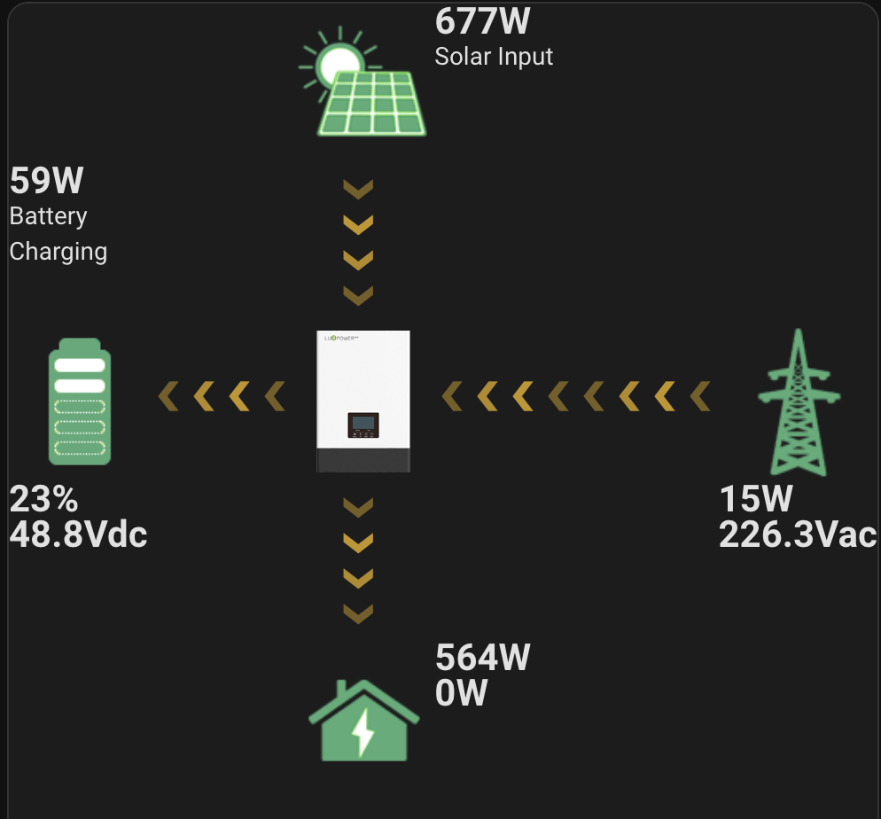

# LuxPower Distribution Card

- [LuxPower Distribution Card](#luxpower-distribution-card)
  - [Introduction](#introduction)
  - [Installation](#installation)
    - [Manual installation](#manual-installation)
  - [Adding the card to the dashboard](#adding-the-card-to-the-dashboard)

## Introduction



This is a custom Lovelace card for the Home Assistant. The card aims to recreate the power distribution card shown on the LuxpowerTek app and website, with a few small changes (and hopefully at some point, some improvements).

The card is far from complete, so please bear with the development process.

## Installation

Currently, the only way to install this card is to do so manually.

### Manual installation

1. Create a new folder in the */config/www/community* folder of your Home Assistant instance with the name *lux-power-distribution-card*.
2. Copy the *lux-power-distribution-card.js* file from the repository into the newly created folder.
3. Add the following reference to your dashboard references:

    */hacsfiles/lux-power-distribution-card/lux-power-distribution-card.js*

**NOTE:** The manual installation reference works if you already have HACS installed. If you don't have it installed, you need to use a different resource.

## Adding the card to the dashboard

Use the following config directly if you have the LuxpowerTek integration:

 ```yaml
type: custom:lux-power-distribution-card
battery_soc:
  entity: sensor.lux_battery
battery_flow:
  entity: sensor.lux_battery_flow_live
home_consumption:
  entity: sensor.lux_home_consumption_live
grid_flow:
  entity: sensor.lux_grid_flow_live
battery_voltage:
  entity: sensor.lux_battery_voltage_live
pv_power:
  entity: sensor.lux_solar_output_live
backup_power:
  entity: sensor.lux_power_to_eps_live
grid_voltage:
  entity: sensor.lux_grid_voltage_live
 ```
